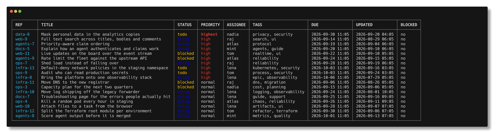
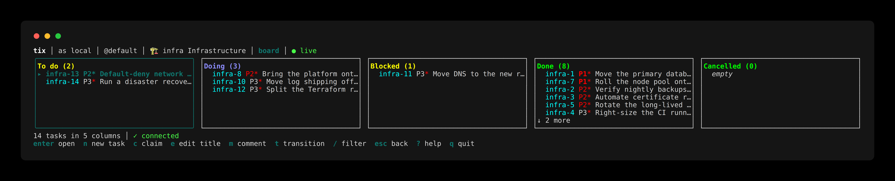
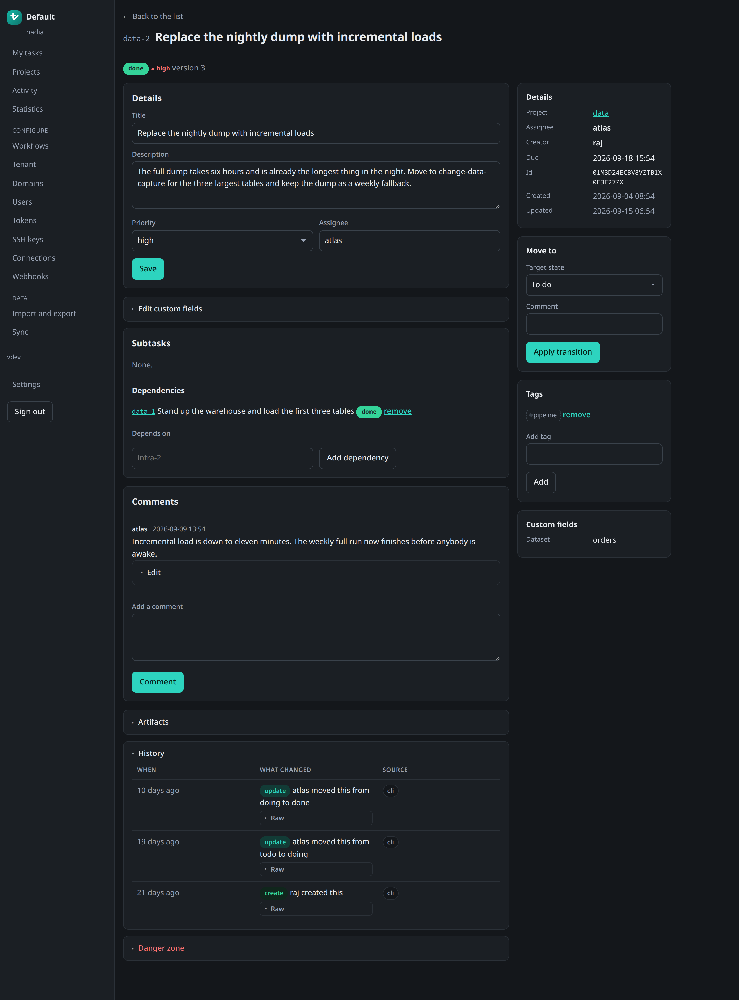

# tix

<!-- Badge markup and link tables are naturally long; wrapping them helps nobody. -->
<!-- markdownlint-disable MD013 -->
<table>
  <tr>
    <th>CI</th>
    <th>Code</th>
    <th>OpenSpec</th>
    <th>Security</th>
  </tr>
  <tr>
    <td>
      <a href="https://github.com/heliopsy/tix/actions/workflows/ci.yaml"></a><br>
      <a href="https://github.com/heliopsy/tix/actions/workflows/release.yaml"></a><br>
      <a href="https://github.com/heliopsy/tix/actions/workflows/codeql.yaml"></a><br>
      <a href="https://github.com/heliopsy/tix/actions/workflows/scorecard.yaml"></a>
    </td>
    <td>
      <a href="https://github.com/heliopsy/tix/releases/latest"></a><br>
      <a href="https://codecov.io/gh/heliopsy/tix"></a><br>
      <a href="https://goreportcard.com/report/github.com/heliopsy/tix"></a><br>
      <a href="https://pkg.go.dev/github.com/heliopsy/tix"></a>
    </td>
    <td>
      <a href="openspec/changes/tix-v1/specs/"></a><br>
      <a href="openspec/changes/tix-v1/specs/"></a><br>
      <a href="openspec/changes/tix-v1/tasks.md"></a><br>
      <a href="openspec/changes/"></a>
    </td>
    <td>
      <a href="https://scorecard.dev/viewer/?uri=github.com/heliopsy/tix"></a><br>
      <a href="SECURITY.md"></a><br>
      <a href="LICENSE"></a><br>
      <a href="CLA.md"></a>
    </td>
  </tr>
</table>
<!-- markdownlint-enable MD013 -->

Task management for humans and AI agents, in one binary. People get boards, workflows and comments.
Agents get an atomic queue pop, a lease that returns work when a worker dies, machine-readable output
everywhere, and a durable event stream. Both work the same tasks in the same store.

> **Status: early.** Every capability described below is built and tested, and the behaviour contract
> in [`openspec/changes/tix-v1/`](openspec/changes/tix-v1/) is validated against it. It has not been
> run by anyone but its author, so expect the rough edges of a first release rather than the polish of
> a used one. The [task list](openspec/changes/tix-v1/tasks.md) says what is done and what is not.

## How it works

```text
$ tix task add "migrate the database" -o json   # creates db, tenant and project on first run
{"ref":"infra-42","title":"migrate the database","status":"todo", ...}

$ tix claim next --project infra -o json        # an agent grabs the next unblocked task
{"task":{"ref":"infra-42", ...},"lease_token":"...","lease_expires_at":"..."}

  → agent works, renewing the lease on a ticker
  → agent crashes
  → lease expires, task returns to the queue automatically, no supervisor involved
```

The lease is the point. A worker that dies holding a task does not leave it stranded, and a zombie
worker whose task was re-claimed cannot overwrite the new holder's work, because renew, transition and
release all require the lease token minted at claim time.

## Why tix?

### For agent workflows

Existing trackers assume an interactive human. There is no atomic "give me the next unblocked task", no
lease that expires when a process dies, and no structured way to write a result back. An agent that
crashes holding a Jira ticket leaves it assigned and stalled until somebody notices.

tix starts from the assumption that a worker may be a process. Claiming is a compare-and-swap, so two
agents racing for the same task resolve correctly with no lock and no server. Every operation speaks
JSON and returns a meaningful exit code. Every mutation emits a durable event, so other workers can
subscribe and a reconnect resumes from a cursor without gaps.

### For humans

The same data, with a board, custom workflows, custom fields, dependencies, comments and history. A
fresh install needs no configuration: one default workflow, no required fields, and `tix task add
"buy milk"` works on a machine that has never seen tix.

### For teams

Multi-tenant, with domains mapping to tenants. Isolation is structural rather than a `WHERE` clause
somebody has to remember: queries are built by a scoped builder that cannot produce an unscoped
statement, and a lint rule forbids raw database calls. On PostgreSQL the same scoping is enforced a
second time by row-level security policies, applied to the connection when tix opens the database.

## Access paths

One binary, one service layer, five ways in. The web UI is required to cover 100% of the CLI, enforced
by a test that fails the build when an operation lacks a binding.

| Path | Notes |
| ------ | ------- |
| CLI | UNIX-composable, `-o table\|json\|yaml`, documented exit codes, works with zero configuration |
| TUI | Terminal board for interactive use, over the same service interface |
| HTTP API | `/api/v1`, keyset paginated, consistent error envelope |
| WebSocket | Subscribe to events, resume from a cursor after a reconnect |
| Web UI | Server-rendered, no JavaScript build step, works without JavaScript |

## Also in the binary

Capabilities that are easy to miss from the command table above.

**Statistics.** `tix stats`, `/stats` in the browser and `S` in the terminal interface, over one
window and optionally one project: completions per day, median and slowest lead time, where the work
is sitting, who moved it, what has waited longest. The leaderboard prints what it counts every time
it is shown, because a count of tasks moved to a terminal state is not a measure of work done and a
number presented without that sentence gets read as one. [docs/statistics.md](docs/statistics.md).

**Theming.** A tenant names an accent and both the browser and the terminal render it. Palettes are
configuration rather than rows, so an operator writes one for the whole deployment. Light, dark and a
low-contrast scheme are a separate axis, chosen per browser, because that is a property of the person
reading. State and priority colours are deliberately not themeable: blocked is red whatever a tenant
brands itself. [docs/theming.md](docs/theming.md).

**A directory of actors.** `tix actor ls` on the command line, `/actors` in the browser, and the same
listing behind the assignee field, which suggests handles instead of asking for an identifier from
memory. It suggests without constraining: an actor from another tenant is still assignable by
identifier. Agents are in the directory alongside people, because work is assigned to them as often.

**A status control that can move more than one step.** The status pill on a row offers the states
that row's own workflow can reach, including ones reachable only through another state. The whole
route is spelled out before it is applied, and each hop is an ordinary transition, so a task that
passed through a state really did pass through it and the audit trail says so.

**Per-browser dates and times.** Format and timezone are chosen in the settings screen and stored in
a cookie, not on the tenant. Two people sharing a tenant are frequently in different zones.

**Lease badges.** A task list says which rows an agent is holding and which ones were claimed by
somebody who never came back, how long ago that claim lapsed and how many times the task has been
picked up. The second of those is read from evidence the sweeper leaves on the task rather than from
the lease columns it clears, which is what makes an abandoned claim visible at all rather than for
the minute before the next sweep. [docs/web-ui.md](docs/web-ui.md) covers these and the rest of the
browser interface.

**Shell completion.** `tix completion install` detects the shell, writes the script where that shell
looks for it and never edits a startup file. It completes task references, project keys, tags and the
states your workflows actually define, not only flag names.
[docs/shell-completion.md](docs/shell-completion.md).

**Self-update.** `tix update` replaces this binary with a release built for its platform, checked
against the checksum published beside it, and refuses a binary the Go toolchain or a package manager
owns. `--check` reports without writing. [docs/upgrading.md](docs/upgrading.md).

**Demonstration data.** `tix demo seed --db /tmp/demo.db` writes a backlog with history: projects,
people, agents, custom fields, tasks with bodies, tags, due dates and comments, and completions
spread across the window by several actors. It is replayed through the ordinary service calls on a
clock the command advances, so the statistics have real audit entries to attribute against, including
two claims an agent took and never gave back so that state can be seen without arranging it by hand.
It refuses a database that already holds work unless `--reset` is passed.

## Screenshots

The same store, three ways in. More in [screenshots/](screenshots/README.md).

| Command line | Terminal |
| --- | --- |
| [](screenshots/cli-task-list.png) | [](screenshots/tui-board.png) |

[](screenshots/web-task-detail.png)

## Quick start

```sh
tix task add "buy milk"        # creates the database, tenant and project on first run
tix task ls
tix claim next                 # an agent grabs the next unblocked task
tix serve                      # HTTP API, WebSocket and web UI on 127.0.0.1:8080
```

No configuration file is required. Every setting also has a `TIX_*` environment variable and can come
from a `.env` file, with precedence `flags > env > .env > config > defaults`.

## Commands

<!-- BEGIN COMMANDS: generated by `tix docs --table`, do not edit by hand -->
### Working with tasks

| Command | Does |
| --- | --- |
| `tix artifact` | Attach and read task artifacts |
| `tix claim` | Take and hold leases on tasks |
| `tix comment` | Manage task comments |
| `tix dep` | Manage task dependencies |
| `tix project` | Manage projects |
| `tix stats` | Report throughput, ageing and who closed what |
| `tix tag` | Manage task tags |
| `tix task` | Create, list and change tasks |
| `tix tui` | Browse and work on tasks in a terminal interface |
| `tix watch` | Follow the event stream |

### Administration

| Command | Does |
| --- | --- |
| `tix actor` | Resolve actor identifiers |
| `tix audit` | Read the audit log |
| `tix bundle` | Share reusable components between projects, tenants and installations |
| `tix connection` | See and end the connections a server holds |
| `tix domain` | Map hostnames to the current tenant |
| `tix export` | Stream a tenant snapshot to standard output |
| `tix field` | Manage project custom fields |
| `tix import` | Apply a tenant snapshot read from standard input |
| `tix member` | Manage tenant membership |
| `tix prune` | Remove history past its retention window |
| `tix retention` | Inspect and change the history retention policy |
| `tix serve` | Serve the tix HTTP API |
| `tix ssh` | Serve the terminal interface over SSH |
| `tix sync` | Import from Jira, OpenProject and shaped files |
| `tix tenant` | Manage tenants |
| `tix theme` | Inspect the palettes a tenant may use |
| `tix token` | Manage API tokens |
| `tix update` | Replace this binary with a published release |
| `tix user` | Manage users |
| `tix webhook` | Manage outgoing webhooks |
| `tix workflow` | Manage workflow state machines |

### Configuration and tooling

| Command | Does |
| --- | --- |
| `tix completion` | Generate a shell completion script |
| `tix config` | Inspect the resolved configuration |
| `tix ctx` | Manage named connection contexts |
| `tix demo` | Fill a database with demonstration data |
| `tix docs` | Emit the command tree as Markdown |
| `tix doctor` | Diagnose the local installation |
| `tix login` | Exchange a password for a session |
| `tix logout` | End a session |
| `tix version` | Print version information |
<!-- END COMMANDS -->

## Install

```sh
go install github.com/heliopsy/tix@latest
```

Binaries and container images are published per release.

## Storage

| Engine     | Use                                                                                   |
|------------|---------------------------------------------------------------------------------------|
| SQLite     | Default. Local and single-user. Pure Go driver, so builds stay `CGO_ENABLED=0`        |
| PostgreSQL | Shared deployments. Adds row-level security, full-text search, partitioned retention  |

One schema and one migration path across both. SQLite is the default and needs nothing configured.
PostgreSQL needs a connection string, passed as `--db postgres://...` or set through `TIX_DATABASE_DSN`
or the config file.

The CLI runs against either engine, in one of two modes. Given a database it opens it directly and
executes the service code in process. Given a server URL instead, as `--server https://...` or
`TIX_SERVER_URL`, it calls a running `tix serve` over the HTTP API, which executes the same service
code there. Nothing else changes: the commands, the output and the exit codes are identical.

## Documentation

| Document | Contents |
| ---------- | ---------- |
| [openspec/changes/tix-v1/](openspec/changes/tix-v1/) | The normative behaviour contract |
| [proposal.md](openspec/changes/tix-v1/proposal.md) | Why tix exists and what it does |
| [design.md](openspec/changes/tix-v1/design.md) | Technical decisions and their trade-offs |
| [tasks.md](openspec/changes/tix-v1/tasks.md) | Implementation checklist by work package |
| [specs/](openspec/changes/tix-v1/specs/) | 23 capabilities, 355 requirements, 1171 scenarios |
| [docs/](docs/) | User and operator guides, indexed in [docs/README.md](docs/README.md) |
| [docs/agents.md](docs/agents.md) | Leases, lease tokens, `tix claim exec`, scopes and exit codes for agents |
| [docs/api.md](docs/api.md) | HTTP API and the WebSocket event stream |
| [docs/deployment.md](docs/deployment.md) | Running `tix serve`, TLS, proxies and the bind guard |
| [docs/web-ui.md](docs/web-ui.md) | The browser interface, and the preferences each reader keeps |
| [docs/statistics.md](docs/statistics.md) | What each figure means, and what the leaderboard counts |
| [docs/theming.md](docs/theming.md) | Tenant accents, defining a palette, what is not themed |
| [docs/shell-completion.md](docs/shell-completion.md) | Installing completions, and what they complete |
| [docs/upgrading.md](docs/upgrading.md) | `tix update`, the checksum, and what it will not replace |
| [AGENTS.md](AGENTS.md) | Coding standards and architecture invariants |
| [CONTRIBUTING.md](CONTRIBUTING.md) | Build, test and pull request process, and what supporting tix actually means |
| [ROADMAP.md](ROADMAP.md) | What comes after v1, and the v1 seams that enable it |
| [SECURITY.md](SECURITY.md) | Reporting a vulnerability, and deployment notes |

### Capabilities

Each links to its normative specification. The first table is the v1 contract; the second is what has
been specified since, which lives with the change that introduced it.

<!-- markdownlint-disable MD013 -->
| | | |
| --- | --- | --- |
| [data-model](openspec/changes/tix-v1/specs/data-model/spec.md) | [multi-tenancy](openspec/changes/tix-v1/specs/multi-tenancy/spec.md) | [domains](openspec/changes/tix-v1/specs/domains/spec.md) |
| [storage-engines](openspec/changes/tix-v1/specs/storage-engines/spec.md) | [configuration](openspec/changes/tix-v1/specs/configuration/spec.md) | [service-layer](openspec/changes/tix-v1/specs/service-layer/spec.md) |
| [transports](openspec/changes/tix-v1/specs/transports/spec.md) | [workflows](openspec/changes/tix-v1/specs/workflows/spec.md) | [task-management](openspec/changes/tix-v1/specs/task-management/spec.md) |
| [claim-lease](openspec/changes/tix-v1/specs/claim-lease/spec.md) | [auth](openspec/changes/tix-v1/specs/auth/spec.md) | [cli](openspec/changes/tix-v1/specs/cli/spec.md) |
| [http-api](openspec/changes/tix-v1/specs/http-api/spec.md) | [event-stream](openspec/changes/tix-v1/specs/event-stream/spec.md) | [webhooks](openspec/changes/tix-v1/specs/webhooks/spec.md) |
| [audit-log](openspec/changes/tix-v1/specs/audit-log/spec.md) | [retention](openspec/changes/tix-v1/specs/retention/spec.md) | [import-export](openspec/changes/tix-v1/specs/import-export/spec.md) |
| [external-sync](openspec/changes/tix-v1/specs/external-sync/spec.md) | [web-ui](openspec/changes/tix-v1/specs/web-ui/spec.md) | [tui](openspec/changes/tix-v1/specs/tui/spec.md) |
| [server](openspec/changes/tix-v1/specs/server/spec.md) | [component-sharing](openspec/changes/tix-v1/specs/component-sharing/spec.md) | |

| | | |
| --- | --- | --- |
| [theming](openspec/changes/archive/2026-09-24-themes-and-completion/specs/theming/spec.md) | [stats](openspec/changes/archive/2026-09-24-themes-and-completion/specs/stats/spec.md) | [ssh-access](openspec/changes/archive/2026-09-22-ssh-terminal-access/specs/ssh-access/spec.md) |
| [live-connections](openspec/changes/live-connections/specs/live-connections/spec.md) | [v0-5-0-polish](openspec/changes/v0-5-0-polish/specs/) | |
<!-- markdownlint-enable MD013 -->

## Development

```sh
just build     # bin/tix
just test      # race detector, shuffled
just check     # fast pre-push gate set
just ci        # the entire CI suite locally, in containers
```

Requires Go and [just](https://just.systems/). Linters, scanners and PostgreSQL run in containers via
podman, so nothing needs installing on the host, and every CI job invokes the same `just` recipe so
local and CI results cannot drift apart.

| Recipe | Does |
| -------- | ------ |
| `just build` / `just build-all` | Build for the host, or the full release matrix |
| `just test` / `just cover` | Tests with the race detector; coverage report |
| `just lint` `just sec` `just vuln` `just trivy` | Individual gates, in the pinned toolbox image |
| `just spec` | `openspec validate --strict` |
| `just pg-up` / `just test-postgres` | PostgreSQL in a container, and the suite against it |
| `just cover-check` | The coverage floor, the headroom above it, and what the run skipped |
| `just ci` | Everything CI runs, locally |

## Licence

[AGPL-3.0](LICENSE). Contributions are accepted under the [CLA](CLA.md), which keeps the option of
offering tix under other terms in future.
