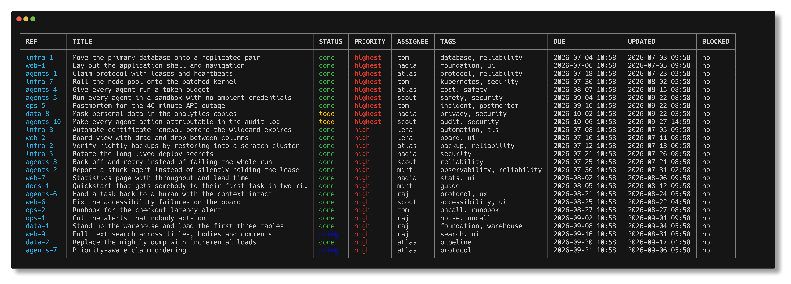
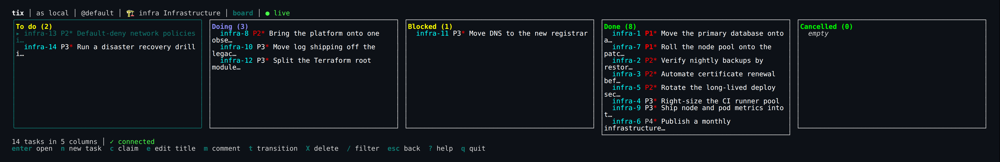
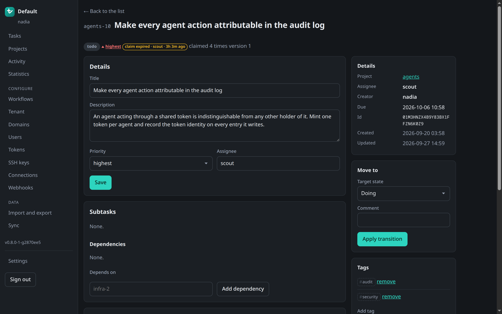

# tix

<!-- Badge markup and link tables are naturally long; wrapping them helps nobody. -->
<!-- markdownlint-disable MD013 -->
<table>
  <tr>
    <th>CI</th>
    <th>Code</th>
    <th>OpenSpec</th>
    <th>Security</th>
  </tr>
  <tr>
    <td>
      <a href="https://github.com/heliopsy/tix/actions/workflows/ci.yaml"></a><br>
      <a href="https://github.com/heliopsy/tix/actions/workflows/release.yaml"></a><br>
      <a href="https://github.com/heliopsy/tix/actions/workflows/codeql.yaml"></a><br>
      <a href="https://github.com/heliopsy/tix/actions/workflows/scorecard.yaml"></a>
    </td>
    <td>
      <a href="https://github.com/heliopsy/tix/releases/latest"></a><br>
      <a href="https://codecov.io/gh/heliopsy/tix"></a><br>
      <a href="https://goreportcard.com/report/github.com/heliopsy/tix"></a><br>
      <a href="https://pkg.go.dev/github.com/heliopsy/tix"></a>
    </td>
    <td>
      <a href="openspec/changes/tix-v1/specs/"></a><br>
      <a href="openspec/changes/tix-v1/specs/"></a><br>
      <a href="openspec/changes/tix-v1/tasks.md"></a><br>
      <a href="openspec/changes/"></a>
    </td>
    <td>
      <a href="https://scorecard.dev/viewer/?uri=github.com/heliopsy/tix"></a><br>
      <a href="SECURITY.md"></a><br>
      <a href="LICENSE"></a><br>
      <a href="CLA.md"></a>
    </td>
  </tr>
</table>
<!-- markdownlint-enable MD013 -->

Task management for humans and AI agents, in one binary. People get boards, workflows and comments.
Agents get an atomic queue pop, a lease that returns work when a worker dies, machine-readable output
everywhere, and a durable event stream. Both work the same tasks in the same store.

> **Status: early.** Every capability described below is built and tested, and the behaviour contract
> in [`openspec/changes/tix-v1/`](openspec/changes/tix-v1/) is validated against it. It has not been
> run by anyone but its author, so expect the rough edges of a first release rather than the polish of
> a used one. The [task list](openspec/changes/tix-v1/tasks.md) says what is done and what is not.

## How it works

```text
$ tix task add "migrate the database" -o json   # creates db, tenant and project on first run
{"ref":"infra-42","title":"migrate the database","status":"todo", ...}

$ tix claim next --project infra -o json        # an agent grabs the next unblocked task
{"task":{"ref":"infra-42", ...},"lease_token":"...","lease_expires_at":"..."}

  → agent works, renewing the lease on a ticker
  → agent crashes
  → lease expires, task returns to the queue automatically, no supervisor involved
```

The lease is the point. A worker that dies holding a task does not leave it stranded, and a zombie
worker whose task was re-claimed cannot overwrite the new holder's work, because renew, transition and
release all require the lease token minted at claim time.

## Why tix?

### For agent workflows

Existing trackers assume an interactive human. There is no atomic "give me the next unblocked task", no
lease that expires when a process dies, and no structured way to write a result back. An agent that
crashes holding a Jira ticket leaves it assigned and stalled until somebody notices.

tix starts from the assumption that a worker may be a process. Claiming is a compare-and-swap, so two
agents racing for the same task resolve correctly with no lock and no server. Every operation speaks
JSON and returns a meaningful exit code. Every mutation emits a durable event, so other workers can
subscribe and a reconnect resumes from a cursor without gaps.

### For humans

The same data, with a board, custom workflows, custom fields, dependencies, comments and history. A
fresh install needs no configuration: one default workflow, no required fields, and `tix task add
"buy milk"` works on a machine that has never seen tix.

### For teams

Multi-tenant, with domains mapping to tenants. Isolation is structural rather than a `WHERE` clause
somebody has to remember: queries are built by a scoped builder that cannot produce an unscoped
statement, and a lint rule forbids raw database calls. On PostgreSQL the same scoping is enforced a
second time by row-level security policies, applied to the connection when tix opens the database.

## Access paths

One binary, one service layer, five ways in. The web UI is required to cover 100% of the CLI, enforced
by a test that fails the build when an operation lacks a binding.

| Path | Notes |
| ------ | ------- |
| CLI | UNIX-composable, `-o table\|json\|yaml`, documented exit codes, works with zero configuration |
| TUI | Terminal board for interactive use, over the same service interface |
| HTTP API | `/api/v1`, keyset paginated, consistent error envelope |
| WebSocket | Subscribe to events, resume from a cursor after a reconnect |
| Web UI | Server-rendered, no JavaScript build step, works without JavaScript |

## What else is in the binary

Statistics, tenant theming, an actor directory, multi-step status moves, per-browser dates, lease
badges, shell completion, self-update and seedable demonstration data.
[docs/features.md](docs/features.md) describes each one and why it is there.

## Screenshots

The same store, three ways in. More in [screenshots/](screenshots/README.md).

| Command line | Terminal |
| --- | --- |
| [](screenshots/cli-task-list.png) | [](screenshots/tui-board.png) |

[](screenshots/web-task-detail.png)

## Quick start

```sh
tix task add "buy milk"        # creates the database, tenant and project on first run
tix task ls
tix claim next                 # an agent grabs the next unblocked task
tix serve                      # HTTP API, WebSocket and web UI on 127.0.0.1:8080
```

No configuration file is required. Every setting also has a `TIX_*` environment variable and can come
from a `.env` file, with precedence `flags > env > .env > config > defaults`.

## Commands

Thirty-nine commands in three groups: working with tasks, administration, and configuration. The full
table is in [docs/commands.md](docs/commands.md); `tix <command> --help` documents every flag, and
`tix docs` emits the whole tree as Markdown.

## Install

```sh
go install github.com/heliopsy/tix@latest
```

Binaries are published per release, signed with cosign.

For a server, the container image is the shorter path: it carries the database path, the bind address and the
subcommand, so there is nothing to configure to get a working one.

```sh
podman run -d -p 127.0.0.1:8080:8080 -v tix-data:/data ghcr.io/heliopsy/tix:0.8.0
```

`linux/amd64` and `linux/arm64` in one manifest list, on distroless as uid 65532 with no shell, and signed
keyless with cosign. Tags are the patch, the minor series and `latest`; there is deliberately no bare `:0`,
because before 1.0 a minor bump is where a break lands. [docs/deployment.md](docs/deployment.md#containers)
has the `cosign verify` invocation, the volume ownership trap a bind mount walks into, and a Kubernetes
manifest.

## Storage

| Engine     | Use                                                                                   |
|------------|---------------------------------------------------------------------------------------|
| SQLite     | Default. Local and single-user. Pure Go driver, so builds stay `CGO_ENABLED=0`        |
| PostgreSQL | Shared deployments. Adds row-level security, full-text search, partitioned retention  |

One schema and one migration path across both. SQLite is the default and needs nothing configured.
PostgreSQL needs a connection string, passed as `--db postgres://...` or set through `TIX_DATABASE_DSN`
or the config file.

The CLI runs against either engine, in one of two modes. Given a database it opens it directly and
executes the service code in process. Given a server URL instead, as `--server https://...` or
`TIX_SERVER_URL`, it calls a running `tix serve` over the HTTP API, which executes the same service
code there. Nothing else changes: the commands, the output and the exit codes are identical.

## Documentation

[docs/README.md](docs/README.md) is the index. The pages people reach for first:

| Document | Contents |
| ---------- | ---------- |
| [docs/agents.md](docs/agents.md) | Leases, lease tokens, `tix claim exec`, scopes and exit codes for agents |
| [docs/commands.md](docs/commands.md) | Every command, grouped |
| [docs/configuration.md](docs/configuration.md) | Contexts, the five layers, `TIX_*` variables, discovery |
| [docs/api.md](docs/api.md) | HTTP API and the WebSocket event stream |
| [docs/deployment.md](docs/deployment.md) | `tix serve`, the container image, Kubernetes, TLS, proxies |
| [docs/features.md](docs/features.md) | Statistics, theming, completion, self-update and the rest |
| [docs/specifications.md](docs/specifications.md) | The normative OpenSpec contract, capability by capability |

| | |
| --- | --- |
| [AGENTS.md](AGENTS.md) | Coding standards and architecture invariants |
| [CONTRIBUTING.md](CONTRIBUTING.md) | Build, test and pull request process |
| [ROADMAP.md](ROADMAP.md) | What comes after v1, and the v1 seams that enable it |
| [SECURITY.md](SECURITY.md) | Reporting a vulnerability, and deployment notes |

## Development

```sh
just build     # bin/tix
just test      # race detector, shuffled
just check     # fast pre-push gate set
just ci        # the entire CI suite locally, in containers
```

Requires Go and [just](https://just.systems/); everything else runs in containers via podman, so
nothing needs installing on the host. [docs/development.md](docs/development.md) lists every recipe
and [CONTRIBUTING.md](CONTRIBUTING.md) covers the process.

## Licence

[AGPL-3.0](LICENSE). Contributions are accepted under the [CLA](CLA.md), which keeps the option of
offering tix under other terms in future.
